# CommerceFabric

### A Polyglot, Distributed, Real-Time, AI-Enabled Commerce Platform

CommerceFabric is a long-running engineering project designed to learn and demonstrate:

- Microservice architecture
- Distributed systems
- REST APIs
- gRPC
- WebSockets
- Redis Pub/Sub
- RabbitMQ
- Apache Kafka
- PostgreSQL
- pgvector
- Distributed transactions
- Idempotency
- Transactional Outbox
- Docker
- Kubernetes
- Helm
- Terraform
- AWS
- OpenTelemetry
- Prometheus
- Grafana
- Loki
- Alertmanager
- TypeScript
- Python
- Go
- Machine learning
- Recommendation systems
- Business AI
- Customer AI
- AIOps
- LLM applications
- RAG
- LLM tool calling
- AI evaluation
- AI security
- CI/CD
- Contract testing
- Integration testing
- Load testing
- Chaos engineering

The system is deliberately **polyglot**. TypeScript/NestJS, Python/FastAPI, and Go services should be able to coexist behind stable contracts.

The goal is not to build dozens of services. The goal is to learn how to:

> **Design, build, test, deploy, observe, scale, troubleshoot, and evolve a distributed system made of independently deployable services.**

---

# 1. Architecture Philosophy

The project follows a **problem → constraint → architecture → technology → failure → improvement** progression.

Do not add technology just to collect technologies.

For example:

```text
Need real-time inventory updates
        ↓
WebSockets

Need multiple WebSocket instances
        ↓
Redis Pub/Sub

Need reliable background work
        ↓
RabbitMQ

Need durable, replayable business events
        ↓
Kafka

Events can arrive more than once
        ↓
Idempotency

DB and Kafka can disagree
        ↓
Transactional Outbox

Many services are hard to operate
        ↓
OpenTelemetry + Prometheus + Grafana + Loki

Infrastructure must scale independently
        ↓
Kubernetes

Infrastructure must be reproducible
        ↓
Terraform

System produces useful behavioral data
        ↓
Recommendation Engine

Business needs forecasts and decisions
        ↓
Business AI

Customers need intelligent assistance
        ↓
Customer AI

Operational complexity increases
        ↓
AIOps
```

---

# 2. Final System Architecture

There is **no giant standalone backend** in the target architecture. The backend is a set of business and platform services.

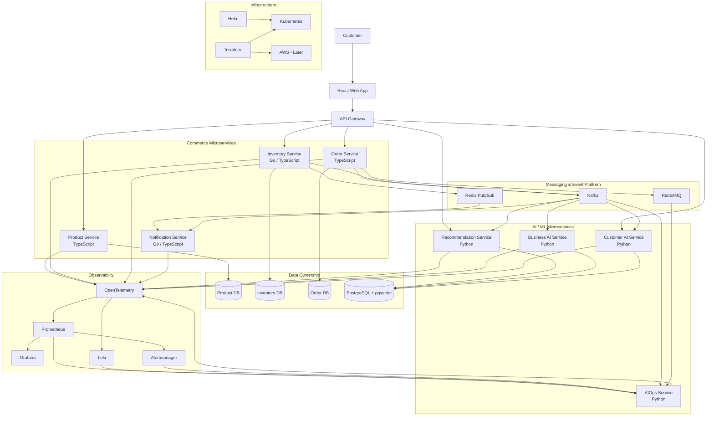

This is the destination architecture. **The system should not start here.**

---

# 3. Microservice Boundaries

Start with a small number of business capabilities.

| Service | Primary responsibility | Initial language | Later learning target |
|---|---|---|---|
| API Gateway | External API boundary, auth, routing | TypeScript | TypeScript |
| Product Service | Product catalog | TypeScript | TypeScript |
| Order Service | Order lifecycle | TypeScript | TypeScript |
| Inventory Service | Stock, reservation, release | TypeScript | Go |
| Notification Service | User notifications | TypeScript | Go |
| Recommendation Service | Product recommendations | Python | Python |
| Business AI Service | Forecasting and decisions | Python | Python |
| Customer AI Service | AI assistant and customer decisions | Python | Python |
| AIOps Service | Operational analysis and remediation | Python | Python |

The polyglot migration exercises should preserve public contracts while changing implementation language.

Example:

```text
Inventory Service v1 → NestJS
Inventory Service v2 → Go

Same API/event contract
Different implementation
```

---

# 4. Service Ownership & Data Boundaries

Each service owns its data.

Prefer:

```text
Product Service   → Product DB
Inventory Service → Inventory DB
Order Service     → Order DB
```

Initially these can all run on the same PostgreSQL server/container. The important property is **logical ownership**, not running a separate database server for every service.

Avoid:

```text
All Services → One shared schema → Anyone can update anything
```

Learn:

- Database ownership
- API boundaries
- Eventual consistency
- Distributed transactions
- Data duplication
- Read models

---

# 5. Cross-Language Contracts

Because services will be written in TypeScript, Python, and Go, contracts become a first-class concern.

Use:

- OpenAPI for REST
- Protobuf for gRPC
- AsyncAPI for events
- JSON Schema where appropriate
- Kafka Schema Registry later
- Buf for Protobuf tooling later

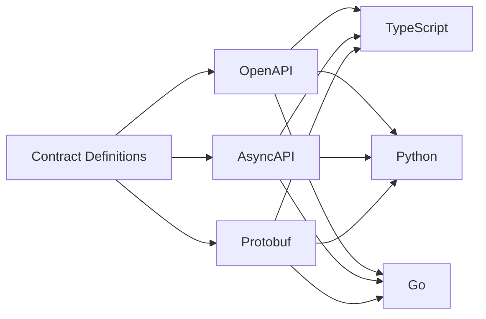

This is also where **contract testing** becomes important.

---

# 6. Testing Philosophy

Testing is not a later phase. It is a **continuous engineering track** throughout the project.

Each service should eventually have:

```text
Unit tests
Integration tests
Component tests where useful
Contract tests
Messaging/event tests
End-to-end coverage
Load/performance tests
Failure/chaos tests
Security tests
```

AI services additionally require:

```text
Evaluation tests
Groundedness tests
Hallucination tests
Tool-call tests
Safety tests
Regression datasets
```

---

# 7. Language-Specific Testing Strategy

## TypeScript / NestJS

Use:

- Jest
- Supertest
- Testcontainers
- Playwright for user-facing E2E

Typical tests:

```text
unit
integration
API
WebSocket
RabbitMQ
Kafka
contract
E2E
```

## Python / FastAPI / ML

Use:

- pytest
- httpx / FastAPI test client
- Testcontainers
- pytest-asyncio where required
- pandas testing utilities
- MLflow evaluation where useful

Typical tests:

```text
API tests
model/data tests
feature tests
retrieval tests
LLM evaluation
Kafka consumer tests
AIOps reasoning/evidence tests
```

## Go

Use:

- `go test`
- table-driven tests
- `httptest`
- race detector
- Testcontainers-Go

Typical tests:

```text
unit
concurrency
HTTP/gRPC
Kafka
Redis
integration
benchmark
```

A major learning objective is that **the behavior and contract stay stable even when the implementation language changes**.

---

# 8. Phase 0 — Development Environment

## Tools

```text
Git
GitHub
Node.js
Python
Go
Docker
Docker Compose
PostgreSQL
Redis
RabbitMQ
Kafka
Make
```

Create common commands:

```bash
make dev
make test
make lint
make build
make down
```

Establish formatting and linting for all three languages.

Suggested tooling:

```text
TypeScript → ESLint + Prettier
Python     → Ruff + Black
Go         → gofmt + go vet
```

---

# 9. Phase 1 — Microservice Skeleton

Create:

```text
api-gateway/
product-service/
inventory-service/
order-service/
```

All can initially be TypeScript/NestJS.

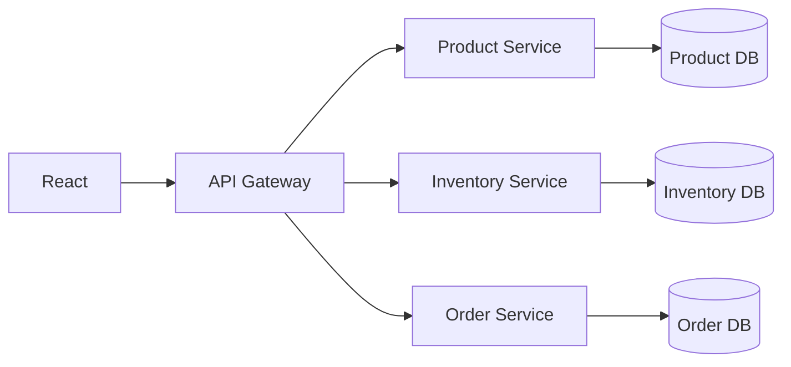

## Testing

Introduce immediately:

```text
[ ] Unit tests
[ ] Service integration tests
[ ] API contract generation
[ ] Testcontainers for PostgreSQL
[ ] CI runs tests on every change
```

---

# 10. Phase 2 — Product Service

Build product CRUD.

```text
POST   /products
GET    /products
GET    /products/:id
PATCH  /products/:id
DELETE /products/:id
```

Learn:

- REST
- OpenAPI
- DTOs
- Validation
- PostgreSQL
- Indexes
- Pagination

## Testing

TypeScript:

```text
unit → product business rules
integration → PostgreSQL
API → HTTP contract
```

Create at least one E2E test:

```text
create product → retrieve product
```

---

# 11. Phase 3 — Inventory Service & Concurrency

Inventory responsibilities:

```text
get stock
reserve stock
release stock
adjust stock
```

Test:

```text
inventory = 1

100 concurrent requests

Expected:
1 successful reservation
99 failures
inventory = 0
```

Learn:

- Transactions
- Race conditions
- Optimistic locking
- Pessimistic locking
- Atomic updates
- Isolation levels

## Testing

Go test target after migration:

```bash
go test -race ./...
```

This introduces the Go race detector and concurrency testing.

---

# 12. Phase 4 — Order Service

Build the order lifecycle.

```text
PENDING
  ↓
CONFIRMED
  ↓
PROCESSING
  ↓
SHIPPED
  ↓
DELIVERED
```

Cancellation:

```text
PENDING → CANCELLED
```

Initially communicate synchronously with Inventory.

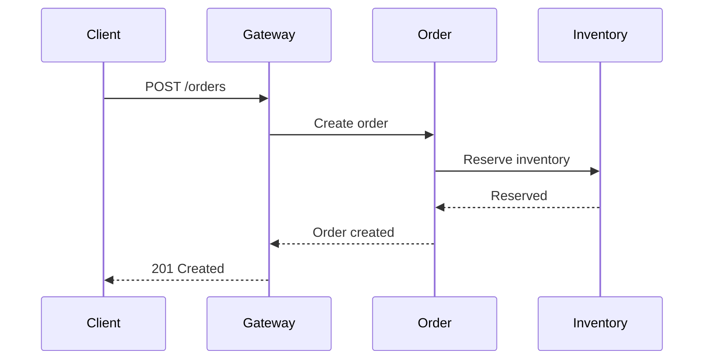

## Testing

```text
[ ] Order unit tests
[ ] Inventory integration tests
[ ] Order ↔ Inventory integration test
[ ] E2E order flow
[ ] Concurrent order test
```

---

# 13. Phase 5 — REST vs gRPC

Introduce gRPC for selected internal communication.

Example:

```text
Order Service
      ↓
    gRPC
      ↓
Inventory Service
```

Learn:

- Protobuf
- Unary calls
- Deadlines
- Timeouts
- Retries
- Error propagation

## Testing

Use generated Protobuf contracts and test:

```text
valid request
invalid request
timeout
service unavailable
backward-compatible schema changes
```

Cross-language target:

```text
TypeScript Order Service
        ↓ gRPC
Go Inventory Service
```

---

# 14. Phase 6 — WebSockets

Add real-time inventory and order status updates.

Events:

```text
inventory.updated
order.status_changed
```

Learn:

- WebSocket lifecycle
- Authentication
- Rooms
- Broadcasting
- Reconnection
- Disconnect handling

## Testing

```text
[ ] Connection authentication
[ ] Event delivery
[ ] Room subscription
[ ] Reconnection
[ ] Disconnect cleanup
[ ] Browser E2E with Playwright
```

---

# 15. Phase 7 — Redis Pub/Sub

Run multiple WebSocket instances.

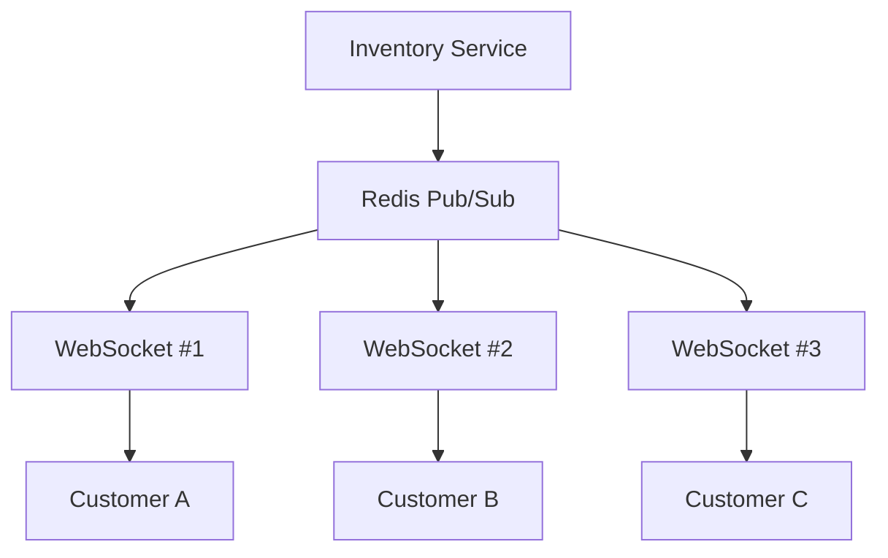

Learn:

- Horizontal scaling
- Connection ownership
- Pub/Sub
- Ephemeral delivery

## Testing

Use Testcontainers for Redis.

Test:

```text
publish event → all active subscribers receive it
subscriber disconnects → no historical replay
Redis unavailable → expected degradation behavior
```

---

# 16. Phase 8 — Notification Service

Create a dedicated Notification Service.

Capabilities:

```text
WebSocket notifications
Email abstraction
Push notification abstraction later
```

Write it in TypeScript first, then later reimplement it in Go.

## Testing

Create the same behavior suite for both implementations.

```text
TypeScript implementation
       ↓
shared contract tests
       ↓
Go implementation
```

This becomes the first **polyglot substitution exercise**.

---

# 17. Phase 9 — RabbitMQ

Move background work to RabbitMQ.

Learn:

- Queues
- Exchanges
- Bindings
- Routing keys
- ACK/NACK
- Prefetch
- Retries
- DLQ
- Competing consumers

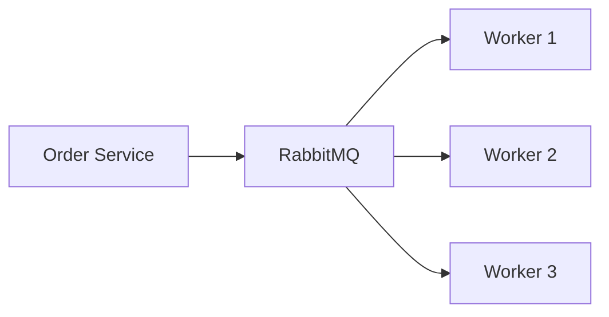

## Testing

Use a real RabbitMQ container.

Test:

```text
publish → consume → ACK
consumer failure → redelivery
retry → retry count
poison message → DLQ
prefetch behavior
```

---

# 18. Phase 10 — RabbitMQ Failure Engineering

Intentionally break:

```text
worker crash
worker timeout
poison message
slow consumer
RabbitMQ unavailable
```

Observe:

```text
queue depth ↑
latency ↑
DLQ ↑
```

## Testing

Turn these into automated integration/failure tests where practical.

---

# 19. Phase 11 — Kafka

Introduce Kafka for durable business events.

Events:

```text
ProductCreated
InventoryReserved
InventoryReleased
InventoryUpdated
OrderCreated
OrderConfirmed
OrderCancelled
OrderShipped
OrderDelivered
```

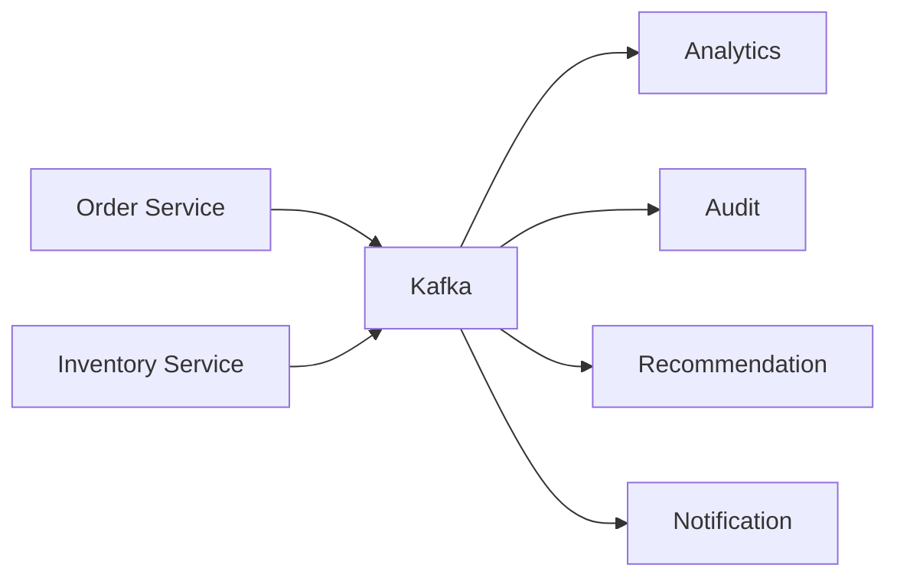

Learn:

- Topics
- Partitions
- Consumer groups
- Offsets
- Retention
- Replay
- Rebalancing
- Ordering
- Consumer lag

## Testing

```text
[ ] Producer contract tests
[ ] Consumer tests
[ ] Partition behavior
[ ] Consumer restart
[ ] Duplicate delivery
[ ] Offset/replay behavior
```

---

# 20. Phase 12 — Kafka Failure & Replay

Experiments:

```text
stop consumer
restart consumer
reset offset
replay events
add new consumer group
add partitions
scale consumers
```

Test the behavior rather than merely observing it manually.

---

# 21. Phase 13 — Idempotency & Transactional Outbox

Implement:

```text
processed_events
outbox_events
```

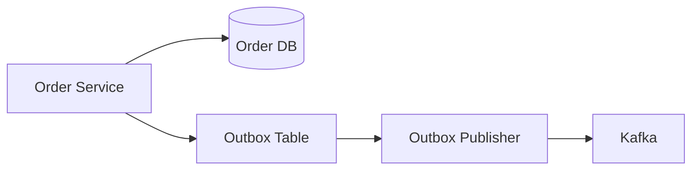

Learn:

- At-least-once delivery
- Duplicate events
- Idempotent consumers
- Event ordering
- Transactional Outbox

## Testing

Mandatory tests:

```text
same event delivered 2x → one business effect
same event delivered 100x → one business effect
DB commit + publisher failure → event remains in outbox
publisher restart → event eventually published
```

---

# 22. Phase 14 — Docker

Containerize all services.

Run the stack with:

```bash
docker compose up
```

Include:

```text
API Gateway
Product
Inventory
Order
Notification
PostgreSQL
Redis
RabbitMQ
Kafka
```

## Testing

Docker Compose becomes the base for local integration/E2E environments.

---

# 23. Phase 15 — Kubernetes

Move services to Kubernetes.

Learn in order:

```text
Pod
Deployment
Service
ConfigMap
Secret
Ingress
Readiness probe
Liveness probe
Resource requests/limits
HPA
```

## Testing

Add:

```text
[ ] Kubernetes deployment smoke tests
[ ] readiness/liveness validation
[ ] rolling update test
[ ] service discovery test
[ ] configuration test
[ ] pod restart test
```

---

# 24. Phase 16 — Kubernetes Scaling

Experiment with:

```text
1 → 2 → 4 → 8 replicas
```

Scale API and workers independently.

Test:

```text
pod dies during traffic
rolling deployment during traffic
consumer pod dies during processing
```

---

# 25. Phase 17 — Observability Foundation

Introduce:

- OpenTelemetry
- Prometheus
- Grafana
- Loki
- Alertmanager

Every service should expose standardized telemetry.

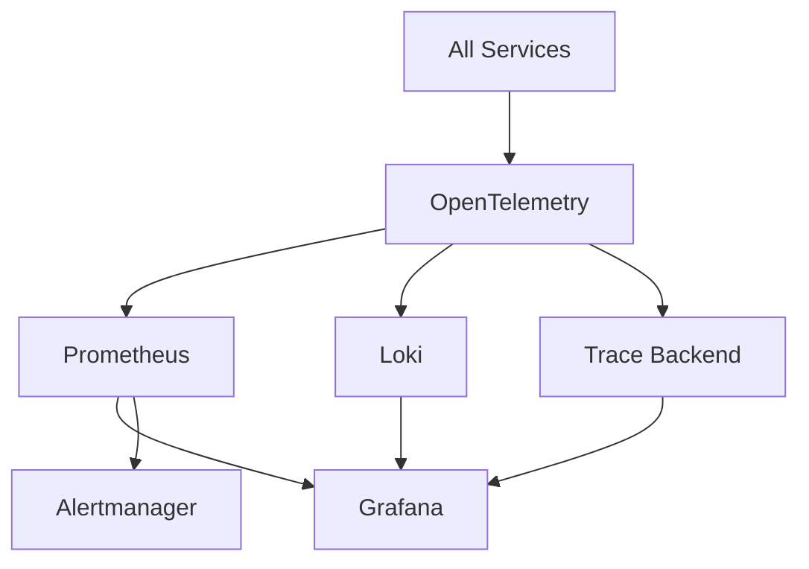

## Testing

Test telemetry itself:

```text
[ ] metrics exposed
[ ] logs contain correlation ID
[ ] traces propagate across service boundaries
[ ] errors recorded
[ ] Kafka/RabbitMQ operations observable
```

---

# 26. Phase 18 — Prometheus Metrics & Grafana

Track:

## HTTP

```text
http_requests_total
http_request_duration_seconds
http_errors_total
```

## Business

```text
orders_created_total
orders_processed_total
orders_failed_total
inventory_reservations_total
```

## Messaging

```text
rabbitmq_queue_depth
kafka_consumer_lag
message_processing_duration
```

## WebSocket

```text
websocket_connections
websocket_disconnects_total
websocket_messages_total
```

Build dashboards for:

```text
Service Health
API
Orders
Inventory
RabbitMQ
Kafka
WebSockets
Kubernetes
Database
```

---

# 27. Phase 19 — Logs, Traces & Alerting

Introduce:

```text
Loki
OpenTelemetry tracing
Alertmanager
```

Every request should carry:

```text
correlation ID
trace ID
```

Example trace:

```text
Gateway
  ↓
Order Service
  ↓
Inventory Service
  ↓
Kafka
  ↓
Notification
```

Test that the trace is visible across service boundaries.

---

# 28. Phase 20 — Terraform

Use Terraform to provision infrastructure.

Local first:

```text
Docker provider where useful
Kubernetes provider
```

Later:

```text
AWS provider
```

Structure:

```text
terraform/
├── environments/
│   ├── dev/
│   └── staging/
└── modules/
    ├── network/
    ├── kubernetes/
    ├── database/
    ├── redis/
    └── monitoring/
```

Learn:

- Providers
- Resources
- Variables
- Modules
- State
- Remote state
- Outputs
- Dependencies
- plan/apply/destroy

## Testing

```text
[ ] terraform fmt
[ ] terraform validate
[ ] terraform plan in CI
[ ] infrastructure smoke tests
[ ] destroy/recreate test
```

---

# 29. Phase 21 — AWS, Later

AWS is optional for the majority of the learning.

Use it when you specifically want to learn cloud infrastructure.

Possible mapping:

| Local | AWS |
|---|---|
| Kind/k3d | EKS |
| PostgreSQL | RDS |
| Redis | ElastiCache |
| Ingress/LoadBalancer | AWS Load Balancer |
| Kubernetes Secrets | Secrets Manager / Parameter Store |
| Terraform | Terraform + AWS provider |

Keep application behavior environment-independent.

---

# 30. Phase 22 — Polyglot Python Services

Introduce Python deliberately where its ecosystem is useful:

```text
Recommendation Service
Business AI Service
Customer AI Service
AIOps Service
```

Use:

```text
Python
FastAPI
pytest
```

The Python services must follow the same:

```text
API contracts
Event schemas
Telemetry conventions
Error model
Authentication model
CI rules
```

---

# 31. Phase 23 — Polyglot Go Services

Move selected infrastructure-sensitive services to Go.

Recommended candidates:

```text
Inventory Service
Notification Service
High-throughput worker
Event processor
```

Learn:

- Goroutines
- Channels
- Context
- HTTP
- gRPC
- Concurrency
- Profiling
- Benchmarks

Use the race detector:

```bash
go test -race ./...
```

---

# 32. Phase 24 — Cross-Language Contract Testing

This deserves its own milestone.

Example:

```text
TypeScript Order Service
        ↓ gRPC
Go Inventory Service
```

and:

```text
Kafka
  ↓
Python Recommendation Service
```

Tests must verify:

```text
schema compatibility
required fields
enum compatibility
backward compatibility
error semantics
versioning
```

The goal is to make language an implementation detail rather than a contract boundary.

---

# 33. Phase 25 — AI/ML Data Platform

Kafka events become the learning data source.

Capture events such as:

```text
ProductViewed
ProductSearched
ProductAddedToCart
ProductPurchased
OrderCancelled
InventoryUpdated
CustomerReturned
```

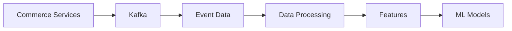

Learn:

- Data collection
- Data quality
- Feature engineering
- Historical datasets
- Training/validation splits
- Feature generation

---

# 34. Phase 26 — Recommendation Engine

Build the recommendation system progressively.

## Stage 1 — Rule-based baseline

```text
Popular products
Frequently bought together
Category recommendations
```

## Stage 2 — Content-based

Use product metadata.

## Stage 3 — Collaborative filtering

Use customer-product interactions.

## Stage 4 — Embedding-based

Use product/customer embeddings with pgvector.

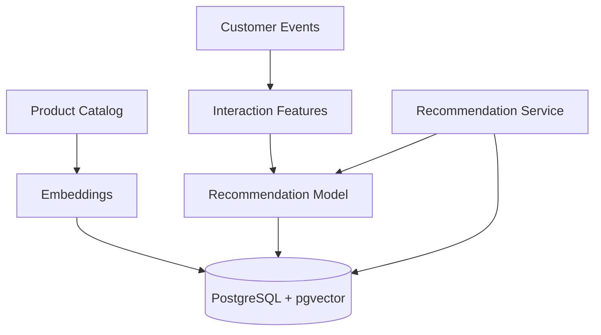

## Is a recommendation engine AI?

Not necessarily.

```text
Rule-based recommendation → not necessarily AI
ML recommendation         → AI/ML
Embedding-based ranking   → AI/ML
LLM-assisted recommendation → AI
```

Implementing all three approaches teaches the difference.

## Testing/evaluation

Measure:

```text
Precision
Recall
CTR
Conversion
Coverage
Diversity
Cold-start behavior
```

Create regression datasets so changes to the model can be evaluated automatically.

---

# 35. Phase 27 — Business AI

Business AI answers:

> **What should the business do?**

Start with demand forecasting.

Inputs:

```text
historical sales
seasonality
promotions
inventory
category
supplier lead time
```

Output:

```text
demand forecast
```

Then build a decision layer:

```text
forecast
+
current inventory
+
lead time
+
safety stock
        ↓
replenishment recommendation
```

Important distinction:

```text
Prediction:
What will happen?

Decision:
What should we do?
```

## Testing/evaluation

```text
MAE
RMSE
MAPE
Bias
Forecast drift
Business outcome simulation
```

Track experiments with MLflow.

---

# 36. Phase 28 — pgvector

Use PostgreSQL + pgvector rather than immediately introducing another database.

Use it for:

```text
Product embeddings
Document embeddings
Customer preference embeddings
Semantic search
Recommendation similarity
RAG retrieval
```

Learn:

- Vector embeddings
- Similarity search
- Top-K retrieval
- Indexing trade-offs
- Metadata filtering

## Testing

Evaluate retrieval independently from the LLM.

```text
query
 ↓
embedding
 ↓
vector retrieval
 ↓
relevant documents/products?
```

---

# 37. Phase 29 — Customer AI

Customer AI answers:

> **What should this customer do?**

Capabilities:

```text
Product discovery
Product recommendations
Order assistant
Shipping questions
Returns questions
Natural-language product search
```

Architecture:

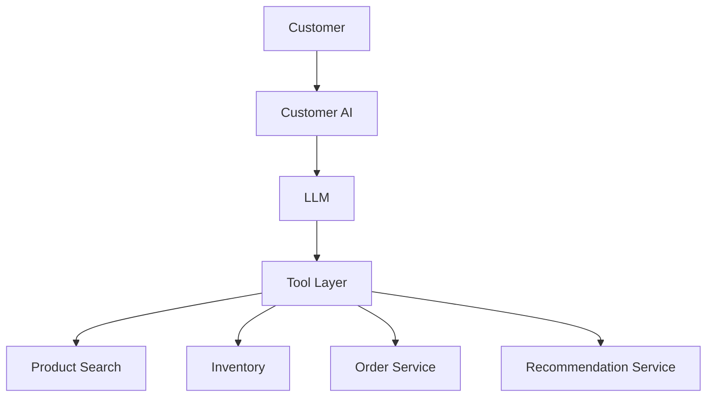

The LLM should obtain operational truth through tools rather than inventing it.

---

# 38. Phase 30 — RAG

Create a knowledge base:

```text
Return Policy
Shipping Policy
Warranty
FAQs
Product Documentation
```

Pipeline:

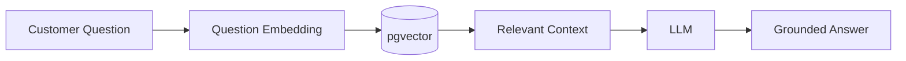

Learn:

- Chunking
- Embeddings
- Retrieval
- RAG
- Grounding
- Context management
- Retrieval evaluation

## Testing

Build a fixed evaluation set:

```text
question
expected source
acceptable answer characteristics
```

Test:

```text
retrieval quality
answer groundedness
unsupported claims
```

---

# 39. Phase 31 — LLM Tool Calling

Create tools such as:

```text
get_order()
get_inventory()
search_products()
get_recommendations()
calculate_shipping()
```

Pipeline:

```text
Customer
  ↓
LLM
  ↓
Tool selection
  ↓
Internal API
  ↓
Actual system state
```

## Testing

Test:

```text
correct tool selection
invalid tool arguments
permission failure
service unavailable
cross-customer data isolation
unsafe tool requests
```

---

# 40. Phase 32 — LLM Observability

Use Langfuse or equivalent tooling.

Track:

```text
prompt
retrieved context
tool calls
model output
latency
tokens
cost
evaluation result
```

This gives the AI system its own observability layer.

---

# 41. Phase 33 — MLflow

Introduce MLflow once several ML models exist.

Track:

```text
model version
dataset version
parameters
metrics
artifacts
experiment
```

Example:

```text
Recommendation Model v1
Recommendation Model v2
Demand Forecast Model v1
```

---

# 42. Phase 34 — AIOps Foundation

AIOps asks:

> **Is the system healthy?**

It consumes:

```text
Prometheus
Loki
OpenTelemetry traces
Alertmanager
Kafka
RabbitMQ
Kubernetes
```

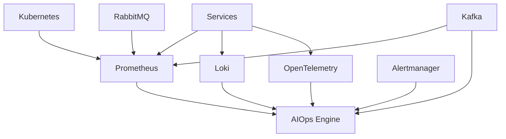

---

# 43. Phase 35 — AIOps Anomaly Detection

Detect anomalies in:

```text
CPU
memory
latency
error rate
queue depth
Kafka lag
database connections
WebSocket connections
```

Start with:

```text
thresholds
rolling averages
statistical baselines
```

Only later introduce more advanced ML.

## Testing

Create synthetic time-series datasets with known anomalies.

Measure:

```text
precision
recall
false-positive rate
false-negative rate
```

---

# 44. Phase 36 — AIOps Alert Correlation

Example:

```text
Worker CPU ↑
+
RabbitMQ backlog ↑
+
Order latency ↑
```

Instead of three separate alerts:

```text
Likely related operational incident
```

Learn:

- Temporal correlation
- Service dependency graphs
- Event correlation
- Incident grouping

---

# 45. Phase 37 — AIOps Root Cause Analysis

Build a service dependency graph.

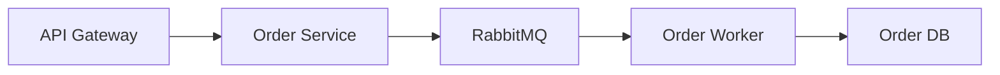

Reason over evidence:

```text
DB latency ↑
   ↓
Worker latency ↑
   ↓
RabbitMQ backlog ↑
   ↓
Order processing latency ↑
```

Do not make AIOps rely on unconstrained guessing.

It should cite the signals it used.

---

# 46. Phase 38 — AIOps Remediation Recommendations

Example output:

```text
Problem:
RabbitMQ backlog increasing.

Evidence:
- Worker CPU = 92%
- Worker replicas = 3
- Queue depth increased 10x
- Database latency normal

Recommendation:
Increase workers from 3 to 6.
```

Start with human approval.

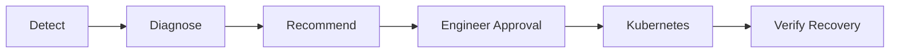

---

# 47. Phase 39 — Autonomous AIOps

Advanced stage:

```text
Detect
 ↓
Correlate
 ↓
Diagnose
 ↓
Recommend
 ↓
Approve
 ↓
Execute
 ↓
Verify
 ↓
Rollback
```

Potential actions:

```text
scale deployment
restart unhealthy pod
increase consumer replicas
pause failing consumer
collect diagnostics
create incident
```

Use:

```text
least privilege
allowlisted tools
approval gates
audit logging
rollback mechanisms
```

---

# 48. Phase 40 — AI Evaluation

Every AI system needs a formal evaluation strategy.

## Recommendation

```text
Precision
Recall
CTR
Conversion
Coverage
Diversity
```

## Forecasting

```text
MAE
RMSE
MAPE
Bias
Drift
```

## Customer AI

```text
Groundedness
Answer correctness
Retrieval quality
Tool-call correctness
Hallucination rate
Safety
```

## AIOps

```text
Anomaly detection precision
False-positive rate
Root-cause accuracy
Recommendation accuracy
Recovery success
```

Treat evaluation datasets as versioned engineering artifacts.

---

# 49. Phase 41 — AI Security

Learn:

```text
Prompt injection
Data leakage
Tool abuse
Excessive permissions
Retrieval poisoning
Sensitive-data handling
Output validation
Audit logging
```

Critical test:

```text
Customer A asks about Customer B's order
        ↓
Must be denied
```

AI tools should use the same authorization boundaries as ordinary application APIs.

---

# 50. Phase 42 — CI/CD

Pipeline:

```mermaid
flowchart LR
    Git["Git Push"]
    Unit["Unit Tests"]
    Integration["Integration Tests"]
    Contract["Contract Tests"]
    E2E["E2E Tests"]
    AI["AI Evaluation"]
    Build["Build"]
    Scan["Trivy Scan"]
    Docker["Docker Image"]
    Deploy["Helm / Kubernetes"]
    Smoke["Smoke Tests"]

    Git --> Unit
    Unit --> Integration
    Integration --> Contract
    Contract --> E2E
    E2E --> AI
    AI --> Build
    Build --> Scan
    Scan --> Docker
    Docker --> Deploy
    Deploy --> Smoke
```

The exact pipeline can differ by service, but every service should run language-appropriate tests.

---

# 51. Phase 43 — Load & Performance Testing

Use k6.

Test:

```text
GET /products
POST /orders
inventory reservation
WebSocket connections
```

Start with:

```text
100 users
500 users
1,000 users
10,000 users
```

Measure:

```text
RPS
P50
P95
P99
error rate
CPU
memory
database connections
RabbitMQ backlog
Kafka lag
WebSocket connections
```

Add Go benchmarks where services are performance-sensitive.

---

# 52. Phase 44 — Chaos & Failure Engineering

Intentionally break:

```text
Redis
RabbitMQ
Kafka consumers
PostgreSQL
workers
pods
network
external dependencies
```

Expected chain:

```text
Failure
 ↓
Telemetry
 ↓
Detection
 ↓
Correlation
 ↓
Diagnosis
 ↓
Recovery
 ↓
Verification
```

Automate selected scenarios as repeatable chaos tests.

---

# 53. Phase 45 — TypeScript → Go Migration Experiment

Take Inventory or Notification Service.

Version A:

```text
NestJS
```

Version B:

```text
Go
```

Keep:

```text
same OpenAPI/gRPC contract
same event contract
same test cases
same observability conventions
```

Compare:

```text
latency
throughput
memory
CPU
startup time
concurrency
developer ergonomics
```

This is a practical Go learning project inside the larger system.

---

# 54. Phase 46 — Python AI Service Engineering

Take the Recommendation, Business AI, Customer AI, and AIOps services from prototype to production-like services.

Add:

```text
FastAPI
pytest
Docker
Kafka consumers
OpenTelemetry
Prometheus
CI/CD
```

The AI service should be operated like any other microservice.

---

# 55. Phase 47 — Final Production Simulation

Run a local production-like environment.

Example:

```text
3 API replicas
3 Inventory replicas
5 workers
3 Kafka consumers
2 Notification replicas
```

Then introduce a hidden failure:

```text
Worker CPU constrained
```

Expected result:

```text
CPU ↑
 ↓
Queue depth ↑
 ↓
Processing latency ↑
 ↓
Prometheus alert
 ↓
AIOps correlation
 ↓
Probable root cause
 ↓
Scaling recommendation
 ↓
Kubernetes action
 ↓
Queue drains
```

---

# 56. Testing Pyramid for CommerceFabric

The final testing strategy can be visualized as:

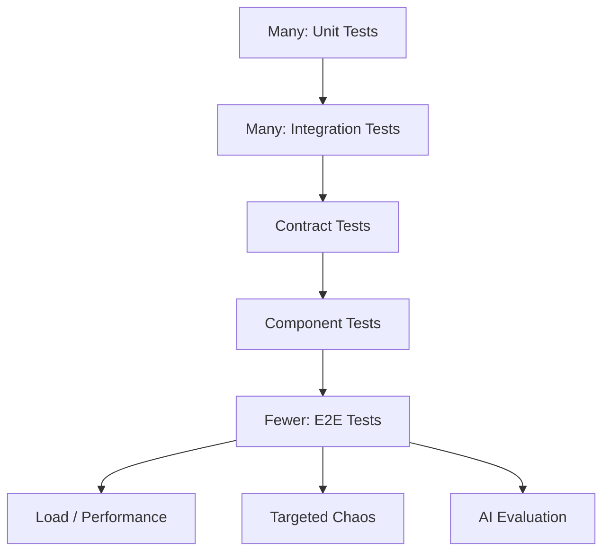

Do not try to make every behavior an E2E test. Prefer the cheapest test that proves the behavior.

---

# 57. Testing Matrix

| Concern | TypeScript | Python | Go | Cross-Service |
|---|---|---|---|---|
| Unit | Jest | pytest | go test | — |
| API | Supertest | FastAPI/httpx | httptest | Contract tests |
| DB integration | Testcontainers | Testcontainers | Testcontainers-Go | — |
| Redis | Testcontainers | Testcontainers | Testcontainers-Go | — |
| RabbitMQ | Testcontainers | Testcontainers | Testcontainers-Go | Event contract |
| Kafka | Testcontainers | Testcontainers | Testcontainers-Go | Event contract |
| gRPC | Protobuf tests | Protobuf tests | Protobuf tests | Contract tests |
| WebSockets | Jest/WS + Playwright | pytest where applicable | Go integration tests | E2E |
| Concurrency | async tests | asyncio tests | `go test -race` | Load tests |
| E2E | Playwright | — | — | Full system |
| Load | k6 | k6 | k6 + benchmarks | Full system |
| Security | Jest/API tests | pytest | Go tests | CI security scan |
| ML | — | pytest | — | Dataset/regression tests |
| LLM | — | pytest/eval framework | — | AI eval suite |
| AIOps | — | pytest/eval framework | — | Incident simulation |

---

# 58. Repository Structure

A monorepo is recommended initially.

```text
commerce-fabric/
│
├── services/
│   ├── api-gateway/
│   ├── product-service/
│   ├── inventory-service/
│   ├── order-service/
│   ├── notification-service/
│   ├── recommendation-service/
│   ├── business-ai-service/
│   ├── customer-ai-service/
│   └── aiops-service/
│
├── contracts/
│   ├── openapi/
│   ├── asyncapi/
│   └── protobuf/
│
├── frontend/
│
├── ml/
│   ├── notebooks/
│   ├── datasets/
│   ├── features/
│   ├── models/
│   └── experiments/
│
├── infrastructure/
│   ├── docker/
│   ├── kubernetes/
│   ├── helm/
│   └── terraform/
│
├── monitoring/
│   ├── prometheus/
│   ├── grafana/
│   ├── loki/
│   └── alertmanager/
│
├── tests/
│   ├── integration/
│   ├── contract/
│   ├── e2e/
│   ├── load/
│   ├── chaos/
│   └── ai-evals/
│
├── docs/
│   ├── architecture/
│   ├── adr/
│   ├── experiments/
│   ├── ai/
│   └── runbooks/
│
├── scripts/
├── docker-compose.yml
├── Makefile
├── README.md
└── PROJECT_PLAN.md
```

---

# 59. ADRs to Maintain

```text
001-microservice-boundaries.md
002-api-gateway.md
003-service-database-ownership.md
004-rest-vs-grpc.md
005-websockets.md
006-redis-pubsub.md
007-rabbitmq.md
008-kafka.md
009-idempotency.md
010-transactional-outbox.md
011-kubernetes.md
012-opentelemetry.md
013-prometheus.md
014-grafana.md
015-terraform.md
016-polyglot-services.md
017-contract-versioning.md
018-recommendation-engine.md
019-pgvector.md
020-business-ai.md
021-customer-ai.md
022-aiops.md
023-ai-security.md
024-testing-strategy.md
```

Each ADR:

```text
Context
Decision
Alternatives
Trade-offs
Consequences
```

---

# 60. Tooling Map

## Languages & Application

| Area | Tool |
|---|---|
| TypeScript | Node.js + TypeScript |
| TypeScript services | NestJS |
| Python | Python |
| Python services | FastAPI |
| Go | Go |
| Frontend | React |
| ORM | TypeORM |

## APIs & Contracts

| Area | Tool |
|---|---|
| External API | REST |
| Internal RPC | gRPC |
| REST contract | OpenAPI |
| Event contract | AsyncAPI |
| RPC contract | Protobuf |
| Protobuf tooling | Buf |
| Event schema management | Kafka Schema Registry, later |

## Databases & Data

| Area | Tool |
|---|---|
| Relational DB | PostgreSQL |
| ORM | TypeORM |
| Vector search | pgvector |
| Experiment tracking | MLflow |

## Messaging

| Area | Tool |
|---|---|
| Real-time Pub/Sub | Redis |
| Work queue | RabbitMQ |
| Event streaming | Kafka |

## Containers & Kubernetes

| Area | Tool |
|---|---|
| Containers | Docker |
| Local stack | Docker Compose |
| Orchestration | Kubernetes |
| Local Kubernetes | Kind / k3d |
| Packaging | Helm |
| GitOps, later | Argo CD |
| Image security | Trivy |

## Infrastructure

| Area | Tool |
|---|---|
| IaC | Terraform |
| Cloud | AWS, later |
| Kubernetes | EKS, later |
| Database | RDS, later |
| Cache | ElastiCache, later |

## Observability

| Area | Tool |
|---|---|
| Telemetry | OpenTelemetry |
| Metrics | Prometheus |
| Dashboards | Grafana |
| Logs | Loki |
| Alerting | Alertmanager |
| Tracing backend | Tempo / Jaeger |
| LLM observability | Langfuse |

## Testing

| Area | Tool |
|---|---|
| TypeScript unit | Jest |
| Python tests | pytest |
| Go tests | go test |
| API testing | Supertest / httpx / httptest |
| Integration environments | Testcontainers |
| Browser E2E | Playwright |
| Contract testing | OpenAPI / AsyncAPI / Protobuf |
| Load testing | k6 |
| Go race detection | `go test -race` |
| Go benchmark | `go test -bench` |
| Security scanning | Trivy |
| AI evaluation | pytest + evaluation framework |

## Developer Tooling

```text
ESLint + Prettier
Ruff + Black
Gofmt + go vet
Make
GitHub Actions
```

---

# 61. Master Learning Sequence

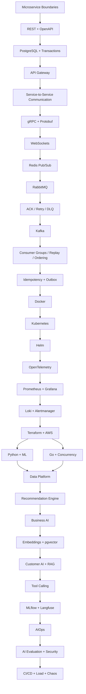

Testing spans the entire sequence instead of appearing as a final stage.

---

# 62. Milestone Plan

## Milestone 1 — Microservices Foundation

```text
[ ] API Gateway
[ ] Product Service
[ ] Inventory Service
[ ] Order Service
[ ] Data ownership
[ ] REST
[ ] OpenAPI
[ ] Unit tests
[ ] Integration tests
[ ] Testcontainers
```

## Milestone 2 — Distributed Communication

```text
[ ] REST service communication
[ ] gRPC
[ ] Protobuf
[ ] Contract tests
[ ] Timeouts
[ ] Retries
```

## Milestone 3 — Real Time

```text
[ ] WebSockets
[ ] Redis Pub/Sub
[ ] Multiple replicas
[ ] Reconnection
[ ] WebSocket tests
[ ] Playwright tests
```

## Milestone 4 — Async Processing

```text
[ ] RabbitMQ
[ ] Workers
[ ] ACK/NACK
[ ] Retry
[ ] DLQ
[ ] Messaging integration tests
```

## Milestone 5 — Event Streaming

```text
[ ] Kafka
[ ] Topics
[ ] Partitions
[ ] Consumer groups
[ ] Replay
[ ] Consumer lag
[ ] Event contract tests
```

## Milestone 6 — Correctness

```text
[ ] Idempotency
[ ] Duplicate events
[ ] Ordering
[ ] Transactional Outbox
[ ] Failure tests
```

## Milestone 7 — Containers & Orchestration

```text
[ ] Docker
[ ] Docker Compose
[ ] Kubernetes
[ ] Helm
[ ] Scaling
[ ] Deployment smoke tests
```

## Milestone 8 — Observability

```text
[ ] OpenTelemetry
[ ] Prometheus
[ ] Grafana
[ ] Loki
[ ] Alertmanager
[ ] Distributed tracing
[ ] Telemetry tests
```

## Milestone 9 — Infrastructure

```text
[ ] Terraform
[ ] Local provider experiments
[ ] Kubernetes provider
[ ] AWS provider, later
[ ] Infrastructure validation
```

## Milestone 10 — Polyglot Engineering

```text
[ ] Python service
[ ] Go service
[ ] Cross-language REST
[ ] Cross-language gRPC
[ ] Cross-language Kafka events
[ ] Shared contract tests
[ ] Go race tests
```

## Milestone 11 — Recommendation AI

```text
[ ] Rule baseline
[ ] Content-based
[ ] Collaborative filtering
[ ] Embeddings
[ ] pgvector
[ ] Evaluation dataset
[ ] MLflow
```

## Milestone 12 — Business AI

```text
[ ] Demand forecasting
[ ] Replenishment recommendation
[ ] Decision engine
[ ] Forecast evaluation
[ ] Model tracking
```

## Milestone 13 — Customer AI

```text
[ ] LLM
[ ] Tool calling
[ ] RAG
[ ] Product search
[ ] Order assistant
[ ] Recommendation integration
[ ] Langfuse
[ ] AI regression tests
```

## Milestone 14 — AIOps

```text
[ ] Anomaly detection
[ ] Alert correlation
[ ] Root-cause analysis
[ ] Remediation recommendation
[ ] Human approval
[ ] Automated remediation
[ ] Operational evaluation tests
```

## Milestone 15 — Production Simulation

```text
[ ] Load testing
[ ] Concurrency testing
[ ] Pod failures
[ ] Service failures
[ ] Queue backlog
[ ] Kafka lag
[ ] DB latency
[ ] AI diagnosis
[ ] Automated recovery verification
```

---

# 63. Final Mental Model

CommerceFabric can ultimately be understood as six layers:

```text
┌──────────────────────────────────────────────┐
│                  CUSTOMER                    │
│                                              │
│ Customer AI / Recommendations                │
├──────────────────────────────────────────────┤
│                  BUSINESS                    │
│                                              │
│ Forecasting / Business AI / Decisions        │
├──────────────────────────────────────────────┤
│                  SERVICES                    │
│                                              │
│ Product / Order / Inventory / Notification   │
├──────────────────────────────────────────────┤
│                  PLATFORM                    │
│                                              │
│ REST / gRPC / Redis / RabbitMQ / Kafka       │
├──────────────────────────────────────────────┤
│                OPERATIONS                    │
│                                              │
│ OTel / Prometheus / Grafana / Loki / AIOps   │
├──────────────────────────────────────────────┤
│              INFRASTRUCTURE                  │
│                                              │
│ Docker / Kubernetes / Terraform / AWS        │
└──────────────────────────────────────────────┘
```

Testing crosses all six layers.

```text
Unit
 ↓
Integration
 ↓
Contract
 ↓
E2E
 ↓
Performance
 ↓
Failure
 ↓
Security
 ↓
AI Evaluation
```

The ultimate progression is:

```text
Build services
     ↓
Connect services
     ↓
Test service boundaries
     ↓
Make them real-time
     ↓
Make them asynchronous
     ↓
Make them distributed
     ↓
Make them reliable
     ↓
Make them observable
     ↓
Make them scalable
     ↓
Make infrastructure reproducible
     ↓
Make the architecture polyglot
     ↓
Collect useful data
     ↓
Build ML systems
     ↓
Build recommendations
     ↓
Build business AI
     ↓
Build customer AI
     ↓
Build AIOps
     ↓
Automate operations safely
```

The final project should let you explain not only **what each technology does**, but also:

- Why it exists
- What problem it solved
- What trade-offs it introduced
- How it fails
- How you tested it
- How you observed it
- How you scaled it
- How you migrated it across languages
- How you know an AI model or agent is behaving correctly

That is the core learning objective of CommerceFabric.
