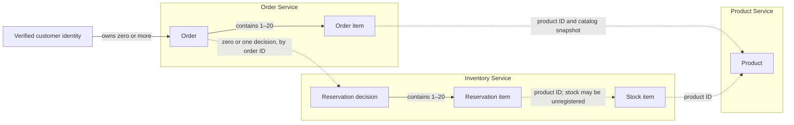
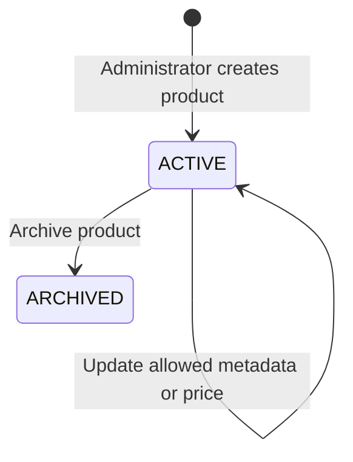
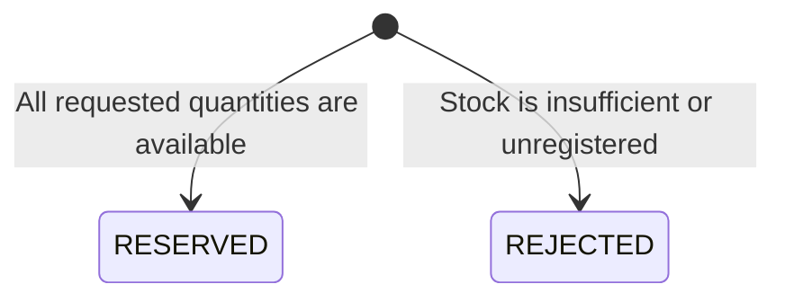
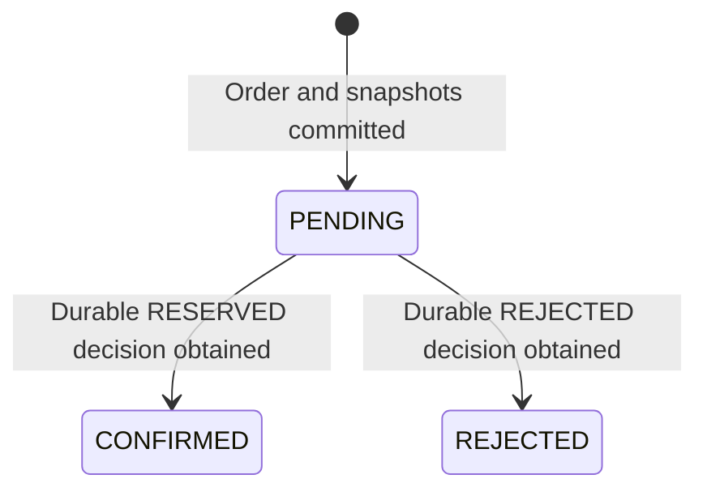

# CommerceFabric Domain Model

Scope: Milestone 01 — Microservices Foundation.

Status: supporting domain model for the overall Milestone 1 design accepted on 2026-09-30. Supporting contracts, ADRs, and a documentation consistency review are recorded; detailed refinements are ready for final owner review. This document does not authorize implementation or design future milestones' databases.

Related documents: [Roadmap](ROADMAP.md), [Milestone 01 design](milestone-01.md), and [Master Plan](../CommerceFabric_Master_Plan.md).

Detailed wire formats and caller rules: [API contracts](api-contracts/milestone-01.md). Decision rationale: [ADRs](adr/README.md).

## 1. Purpose and document boundaries

The first flow is:

> An administrator creates a product and registers stock. A customer submits an order. Inventory makes a durable reservation decision, and Order records the result.

This document defines what the domain concepts mean, which service owns them, and what must remain true when they change. The milestone plan defines the corresponding tables, indexes, APIs, technology, and recovery mechanics. Changes to business rules must be reflected in both documents.

Payments, fulfillment, cancellation, reservation expiry, multiple warehouses/currencies, customer registration, and AI are outside this model. Later milestones extend the model through their own planning and schema migrations.

## 2. Domain language

| Term | Meaning in Milestone 01 |
| --- | --- |
| Product | A catalog entry with a stable identity, SKU, current metadata, and current selling price |
| SKU | The administrator-facing unique code for a product; canonical uppercase, immutable, and never reused |
| Stock item | Inventory's balance for one product at the single implicit stock location |
| On-hand stock | The recorded quantity present at that location, including units already reserved |
| Reserved stock | Units allocated to successful reservations and unavailable to new orders |
| Available stock | `on_hand - reserved`; a derived balance |
| Reservation | Inventory's durable decision for a particular order, including a successful allocation or a recorded rejection |
| Reservation item | A product ID and quantity included in that decision |
| Order | A customer's accepted submission, its immutable line/price snapshots, and its processing outcome |
| Order item | A product reference, requested quantity, and accepted catalog snapshot belonging to an order |
| Accepted order | An order and all its lines have been committed as `PENDING`; acceptance does not mean stock is secured |
| Confirmed order | Order has recorded Inventory's successful reservation decision |
| Rejected order | Order has recorded Inventory's definitive business rejection |
| Pending order | An accepted order whose reservation outcome has not yet been recorded by Order |
| Submission key | A customer-scoped idempotency key identifying one order submission across retries |
| Business rejection | A definitive result such as insufficient stock or an unregistered stock item |
| Uncertain outcome | A timeout, lost response, or infrastructure failure that does not establish whether an operation committed |

The reservation name covers both successful and rejected decisions. A rejected reservation has requested lines but no allocated stock.

## 3. Actors and ownership boundaries

| Actor or service | Responsibilities |
| --- | --- |
| Customer | Browse active products, submit an order, and view their own orders |
| Administrator | Create/update/archive products and register/set stock balances |
| API Gateway | Authenticate, route, and correlate requests; it owns no business entities |
| Product Service | Own the catalog, SKU identity, current price, and active/archived state |
| Inventory Service | Own stock balances and durable reservation decisions |
| Order Service | Own accepted orders, customer ownership, snapshots, submission keys, and outcome recovery |

Customer and administrator are roles attached to verified local development identities. A customer identity is a UUID from the verified token subject, not a user-supplied order field. Milestone 01 has no customer/profile/password database. Administrative access to product and stock operations does not grant access to customers' orders.

Each business service is the only writer of its domain data. Another service obtains information or requests a change through its API. Sharing a PostgreSQL server does not grant shared table ownership.

## 4. Entities and consistency boundaries

An entity has an identity that remains stable while its attributes change. An aggregate is a group of related data changed as a unit under one owner. These concepts guide transaction boundaries; they do not require a particular domain framework or class hierarchy.

| Entity / group | Identity | Owned data | Consistency boundary |
| --- | --- | --- | --- |
| Product | Product UUID | SKU, name, optional description, price, currency, status | One catalog entry in Product |
| Stock item | Product UUID | On-hand and reserved quantities | One product balance in Inventory |
| Reservation and its items | Reservation UUID; unique order UUID | Requested products/quantities, payload identity, terminal decision, rejection reason when applicable | Decision and all requested stock effects commit together in Inventory |
| Order and its items | Order UUID | Customer UUID, submission key, request identity, catalog snapshots, total, status, rejection reason when applicable | Accepted order and all lines commit together in Order |

Order items are identified by `(order_id, product_id)` and reservation items by `(reservation_id, product_id)`. Each product appears once per request; duplicate product lines are rejected. There is no independently editable order-line lifecycle.

Inventory may update several stock items and one reservation within one local transaction. This is intentional: either every requested quantity is allocated or none is. No local transaction spans Order and Inventory, and no database transaction is held open during an HTTP call.

### Conceptual relationships

Solid lines describe ownership/containment. Dashed lines describe conceptual references across independently owned data or lookups; they are not declarations of database foreign keys. The physical relationship rules are in the [milestone database model](milestone-01.md#5-database-model--this-milestone-only).

A pending order may have no reservation decision yet, or a committed decision whose response has not been recorded by Order. Every reservation decision references one previously persisted order. A catalog product may exist before its stock item is registered.

## 5. Values and snapshots

| Value | Rules |
| --- | --- |
| Product/order/customer identifiers | UUIDs with stable meaning within their owning domain |
| SKU | 1–64 characters; canonical uppercase; globally unique within the catalog |
| Product name | 1–200 characters |
| Product description | Optional; up to 2,000 characters |
| Money | USD only; integer cents; unit price from 0 to 100,000,000 cents |
| Quantity | Integer from 1 to 100 per requested product |
| Order size | 1–20 distinct products |
| Stock balance | Integer from 0 to 1,000,000,000; reserved cannot exceed on-hand |
| Submission key | 1–128 printable ASCII characters; unique per customer |
| Request identity | Hash of a normalized, sorted product-ID/quantity list; no client price or server-derived price included |
| Timestamp | UTC instant; creation time stays fixed |

SKU input is trimmed and uppercased, then validated as `[A-Z0-9][A-Z0-9._-]{0,63}`. Submission keys must not have leading/trailing whitespace. These refinements make canonical identity and retry behavior explicit in the API contract.

Use integer arithmetic for money. API money values are decimal strings representing minor units: `"2599"` means USD 25.99. Currency accompanies the amount. This avoids treating the string as a dollar amount or calculating prices with floating-point arithmetic.

When accepting an order, Order obtains product details from Product and snapshots the SKU, name, unit price, and currency. Order calculates each line total as snapshot unit price × quantity and the order total as the sum of line totals. Customers cannot override these prices through request fields.

Snapshots remain unchanged when the product's name, description, price, or active state later changes. Current catalog state and accepted order history serve different purposes.

## 6. Lifecycles and operations

### Product

Active products can be offered to new orders and used for stock registration. Archived products are excluded from active catalog lookup. Archival preserves the product ID and SKU and does not change existing orders or stock balances. Reactivation is not defined in Milestone 01.

Order acceptance uses the active product snapshot obtained during validation. A catalog change racing with acceptance does not retroactively revoke that snapshot. There is no atomic catalog-and-order transaction or guaranteed price freeze between browsing and submission.

### Stock item

The administrator registers a stock item for an active product, with `reserved = 0`. Later, the administrator can set its absolute on-hand count, provided the new count is at least the already reserved quantity. Stock records are retained in this milestone.

Successful reservation increases reserved stock. On-hand does not decrease until a future fulfillment design introduces that operation. Available stock is a computed view of the balance and is never maintained as a separate counter.

### Reservation decision

Inventory records exactly one durable terminal decision per order ID. It records the requested items with either decision. A successful decision changes all requested stock counters in the same transaction; a rejection changes none.

There is no externally visible intermediate reservation state. If its local transaction fails, no new decision or stock effect is committed. Repeating a decided request returns the saved decision. A rejected decision does not become successful after replenishment; placing a new order requires a new submission key.

Reservations do not expire or release in this milestone. Successful reservations remain allocated, including after order confirmation. Future cancellation, expiry, and fulfillment need additional coordinated states and operations.

### Order

`PENDING` means accepted work still needs an outcome. It may already have allocated stock in Inventory. A timeout alone does not justify a rejection.

Confirmed and rejected orders are terminal in Milestone 01. Repeated reads/retries return the same identity and immutable contents. Order records a definitive rejection reason when it applies the rejected reservation decision.

Invalid input or an unavailable product before acceptance produces an API error without creating an order. That is distinct from a persisted `REJECTED` order after Inventory evaluates a valid accepted submission.

## 7. Business invariants

| Rule | Where it is protected |
| --- | --- |
| Product IDs/SKUs remain stable; SKUs are unique and never reused | Product validation and database uniqueness |
| An order has 1–20 distinct product lines with positive bounded quantities | Order validation and local line constraints |
| A reservation contains the saved order's product IDs and quantities | Order-to-Inventory contract and payload comparison |
| Available stock never becomes negative | Inventory transaction, row locks, and stock constraints |
| A multi-item reservation allocates all requested items or none | One Inventory transaction |
| Reserved stock equals quantities in all successful reservations for that product | Inventory write protocol and aggregate reconciliation checks |
| One customer/submission key identifies at most one order | Order database uniqueness and request comparison |
| One order ID identifies at most one reservation decision | Inventory database uniqueness and request comparison |
| A duplicate request has no additional business effect | Durable keys/decisions, including after restart |
| Order total equals the sum of snapshot-price × quantity across its lines | Order calculation in the acceptance transaction and reconciliation tests |
| Existing order contents do not change with catalog updates | Immutable snapshots |
| Customers see only their own orders | Verified identity and Order authorization |
| A confirmed order has a successful reservation; a rejected order has a rejected decision | Order applies only Inventory's durable decision |
| Uncertain accepted work remains pending until its decision is recovered | Order orchestration and periodic reconciliation |

Some invariants span multiple rows or services. They cannot all be expressed as individual table checks. Local constraints, transactions, contract tests, and recovery tests must prove the appropriate parts.

## 8. Consistency, retries, and recovery

The workflow has three separate durable steps:

1. Order persists `PENDING` with its customer, submission identity, lines, and total.
2. Inventory persists the decision and any stock allocation atomically.
3. Order persists the terminal outcome based on that decision.

Between steps, the two services can temporarily show different progress. For example, Inventory may report `RESERVED` while Order still reports `PENDING`. That is a recoverable intermediate situation, not permission to reserve again under a new ID or release stock.

Order retries using the original order ID and saved quantities. Its recovery process can inspect or repeat Inventory's operation to obtain the same durable decision. Recovery changes processing metadata and order status; it never replaces saved prices or lines.

The submission key identifies the customer's intent across retries. Reuse with the same normalized request returns the existing order; reuse with changed contents returns a conflict. Another customer can use the same key independently. Order checks existing submissions before fetching fresh prices.

Submission keys and reservation decisions are retained for this milestone. There is no retention expiry that permits a previously accepted action to execute again. Recovery assumes the dependencies eventually become available; permanently unavailable dependencies leave visible pending work.

## 9. Worked examples

### A successful order and later price change

| Step | Catalog / order | Inventory |
| --- | --- | --- |
| Administrator sets up product | SKU `MUG-001`, price USD 25.00 | On-hand 10, reserved 0, available 10 |
| Customer orders two mugs | Snapshot unit price 2,500 cents; total 5,000 cents; order pending | No decision yet |
| Inventory reserves | Decision `RESERVED` for two mugs | On-hand 10, reserved 2, available 8 |
| Order records outcome | Order confirmed | Reservation unchanged |
| Administrator changes price | Current price USD 30.00; existing order total still USD 50.00 | Reservation unchanged |

### Competing for the last item

On-hand is 1 and reserved is 0. Two different accepted orders request one unit each. Inventory serializes access to the stock row: one decision reserves the unit and the other rejects. After both outcomes are applied, one order is confirmed and one is rejected; on-hand is 1, reserved is 1, and available is 0.

### An insufficient multi-item order

Product A has five available units and Product B has zero. An order requests one of each. Inventory records a rejected decision with both requested lines and changes neither stock balance. Product A's available stock remains five.

### A lost response

Inventory commits a successful decision for order X, but Order loses the response. X stays pending temporarily. Recovery asks about X using the same order ID, obtains the committed decision, and confirms X. Reserved stock increases only once.

## 10. Domain model evolution

Schema migration is a way to implement an agreed domain change. Changing tables alone does not establish safe behavior across independently deployed services.

For a future milestone, first define the new business rule and state transitions, then plan compatible API/schema changes, data backfill, deployment order, validation, and recovery. Migration history belongs to the service owning the capability even if its implementation language changes.

Moving Product's database to another server should preserve Product ownership, identifiers, and API meaning. Scaling Order processes should preserve submission uniqueness and reservation idempotency. A stale read replica must never become the authority for allocating stock. The [roadmap](ROADMAP.md#database-learning-progression) schedules these experiments without adding their future schemas here.

## 11. Review checklist

- [ ] Review the single-location inventory and USD-only assumptions.
- [ ] Confirm the distinction between accepted, pending, and confirmed orders.
- [ ] Confirm immutable catalog snapshots and the archive/price race semantics.
- [ ] Confirm cancellation, expiry, and fulfillment remain outside Milestone 01.
- [x] Check the domain rules against the planned schema, API, and failure-test specifications.
- [x] Record accepted ownership and recovery decisions in ADRs.
