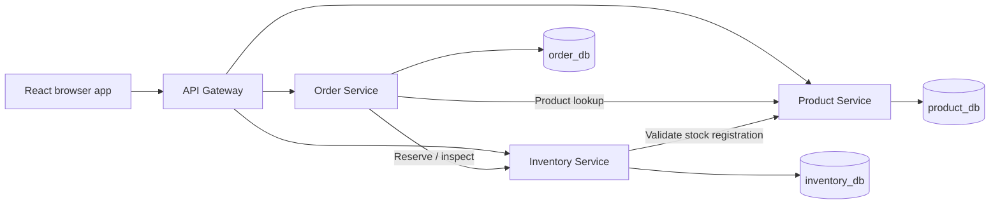
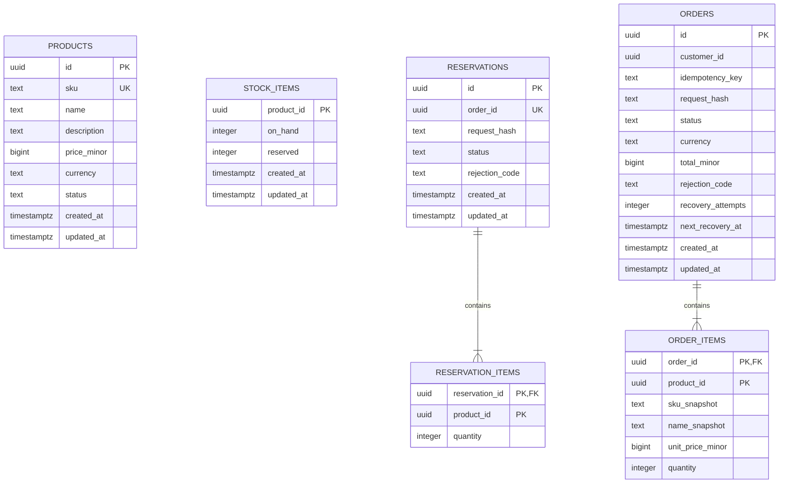
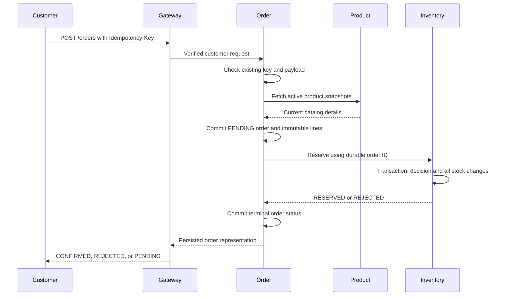

# Milestone 01 — Microservices Foundation

Status: planning package complete and ready for final owner review. The overall design and latest-stable version policy, with the TypeScript exception, were accepted on 2026-09-30. Detailed API and operational refinements are documented below. Implementation has not been authorized.

Parent: [Roadmap](ROADMAP.md). Overall goal: [Master Plan](../CommerceFabric_Master_Plan.md).

Business concepts, entity relationships, lifecycle rules, and worked examples are documented in the [Domain Model](domain-model.md). This plan defines their database and implementation design; keep the two documents consistent as decisions are reviewed.

Supporting specifications: [API contracts](api-contracts/milestone-01.md), [architecture decisions](adr/README.md), [exact versions and compatibility evidence](technology/milestone-01.md), [database operations](runbooks/milestone-01-database-operations.md), and [planning consistency review](reviews/milestone-01-planning.md).

## 1. Goal and learning outcomes

Build the smallest complete commerce flow that demonstrates independent services, owned databases, explicit contracts, concurrency, and recoverable failures:

> An administrator creates products and stock. A customer browses products, submits an order, and sees whether inventory was reserved.

Learn why a local database transaction cannot make an HTTP call to another service atomic; how to prevent overselling; how to retry an accepted order safely; and how to evolve and restore a service-owned database.

### Scope

- API Gateway, Product, Inventory, and Order services, initially TypeScript/NestJS.
- Minimal React storefront and administration screens.
- REST with OpenAPI contracts and explicit validation/error conventions.
- PostgreSQL with separate logical databases and roles for each business service.
- Versioned service-owned migrations and isolated synthetic seed data.
- Product CRUD with archival rather than physical deletion, stock administration, order creation/list/detail, and stock reservation.
- Customer/admin authorization using local development identities; service authentication.
- Request idempotency and recovery of accepted orders after interrupted service calls.
- Unit, API, real-database integration, concurrency, and selected browser tests; initial CI.
- Structured logs, request correlation, health endpoints, and one traced service flow.
- Baseline query-plan, populated migration, and backup/restore experiments.

### Exclusions

Payments, tax, shipping, discounts, cart persistence, user registration/passwords, production identity management, multiple currencies, multiple warehouses, cancellation, reservation expiry, brokers, WebSockets, gRPC, Kubernetes, Go, Python, and AI.

Confirmed orders retain their inventory reservation in this milestone. There is no shipping/fulfillment workflow yet. Cancellation and expiry require a coordinated state-machine design in Milestone 02; simply expiring every reservation could invalidate a confirmed order.

## 2. Proposed decisions

These are concrete defaults for review, not claims that implementations already exist.

| Decision | Proposal | Reason / trade-off |
| --- | --- | --- |
| Architecture | Four separate backend processes with their own builds and configuration | Learn deployment and network boundaries immediately |
| Initial language | TypeScript for all four | Learn distributed behavior before language differences |
| Database ownership | Three logical databases on one PostgreSQL instance | Enforce ownership without needing three database servers |
| Gateway persistence | No business database | Routing/authentication does not own product, stock, or order state |
| Internal communication | HTTP REST | Transparent baseline before gRPC comparison |
| Inventory model | One stock location; on-hand and reserved counts | Available stock is derived and cannot drift as a third stored counter |
| Concurrency | PostgreSQL row locks with consistent lock ordering | Demonstrate correctness under competing reservations |
| Order orchestration | Persist pending order, reserve idempotently, persist outcome | Survive uncertain responses without a cross-service transaction |
| Recovery | Small periodic reconciler in Order, backed by pending rows | Repair interrupted accepted work without a broker |
| Money | USD, integer minor units; API amounts represented as decimal strings | Avoid floating-point money and JavaScript bigint serialization issues |
| Order size | 1–20 distinct products; quantity 1–100 per product | Bound validation, lock sets, and test scenarios |
| Product lifecycle | Active or archived; stable product ID and SKU | Preserve historical references |
| Identity | Two synthetic customers and one admin through local signed-token fixtures | Test authorization without building an identity service |
| Service credentials | Distinct local credentials per caller with endpoint allowlists | Separate trusted service operations from customer access |
| Frontend state | React component state and a small API layer | The first flow does not need a global state framework |

## 3. Architecture and ownership



| Component | Owns | Must not own or access directly |
| --- | --- | --- |
| Gateway | Public routing, token verification, request correlation, response mapping | Business tables or direct database access |
| Product | Product metadata, SKU, current price, active/archived state | Stock balances or order records |
| Inventory | Stock balances and reservation decisions | Product price or order status |
| Order | Customer ownership, order state, immutable line/price snapshots, request idempotency, recovery schedule | Inventory mutations through SQL or current catalog writes |
| Frontend | Display state and the current submission's retry key | Database credentials, service credentials, or trusted customer identity |

Each business service has an application role restricted to its database and DML operations. A separate migration role owns DDL permissions. Explicitly remove broad database/schema grants where needed; test negative access across service databases. Bootstrap administration credentials never go into service runtime configuration.

Runtime permissions are restricted per table: catalog archival is an update, order/reservation history cannot be deleted, and immutable lines are read/insert only. The [database operations plan](runbooks/milestone-01-database-operations.md) defines the role permissions and startup order.

A single server remains a shared failure and resource boundary. Separating logical databases establishes ownership; Milestone 09 will move one database to another server.

Foreign keys exist only within an owned database. Product UUIDs in Inventory and Order are external references, validated through APIs where required. No cross-database joins, views, ORM entities, or distributed foreign keys.

## 4. User journeys

| Journey | Expected behavior |
| --- | --- |
| Admin creates a product | Valid SKU, name, and USD price are persisted; product is active |
| Admin registers stock | Existing active product receives a stock row with an initial on-hand count |
| Admin sets stock | Absolute on-hand count is updated under a lock; a value below reserved stock is rejected |
| Customer browses | Active products and current available-stock snapshots are displayed |
| Customer submits | Server obtains prices, saves the order, and attempts reservation |
| Reservation succeeds | Order becomes `CONFIRMED`; availability decreases exactly once |
| Stock is insufficient | Order becomes `REJECTED`; no item in that order changes stock |
| Dependency outcome is uncertain | Order stays `PENDING`; UI shows that processing continues |
| Customer reloads | Own orders and persisted states are available |
| Customer retries a submission | Same key and payload return the same order; changed payload with that key is rejected |

Browsing stock is informational. Reservation is the authoritative availability decision. Frontend help text should explain that displayed availability can change before ordering and that pending orders should be checked or retried with the existing key.

## 5. Database model — this milestone only

### Shared conventions

- Application-generated UUID identifiers; timestamps are PostgreSQL `timestamptz` and serialized as UTC ISO 8601.
- Identifiers, foreign-key columns, state values, and required business fields are non-null unless explicitly marked optional.
- Use checked text values for states rather than PostgreSQL enums initially, making state evolution an explicit migration exercise later.
- Quantities use bounded integers. Money uses nonnegative `bigint` minor units, with USD prices capped at 100,000,000 cents per unit; enforce input and database bounds.
- `created_at` is immutable. `updated_at` is updated by the owning application in the same transaction as changes.
- Financial snapshots and order lines are immutable after order acceptance. No cross-database cascading deletion.
- Each database includes its own TypeORM migration-history table. Seed data is not mixed into schema history.
- Product SKU shape, money-string representation, request normalization, and error codes are defined in the [API contracts](api-contracts/milestone-01.md).



`products` belongs to Product; `stock_items`, `reservations`, and `reservation_items` belong to Inventory; `orders` and `order_items` belong to Order. Similar product/order identifiers between databases are API references, not foreign keys. The diagram intentionally has no relationship lines spanning databases.

### Product database

| Table | Fields and rules | Indexes / operations |
| --- | --- | --- |
| `products` | `id`; canonical uppercase `sku` (1–64 characters, unique); `name` (1–200); optional `description` (up to 2,000); `price_minor`; `currency = USD`; `status = ACTIVE or ARCHIVED`; timestamps | PK `id`; unique `sku`; `(status, created_at, id)` for deterministic catalog pagination |

Product creation and updates validate price bounds. SKU is immutable and never reused in this milestone. Price/name updates affect future accepted orders; existing orders retain their snapshots. Delete means archive. An archive racing with an order does not revoke a product snapshot already accepted by Order; stronger cross-service coordination is outside this milestone.

### Inventory database

| Table | Fields and rules | Indexes / operations |
| --- | --- | --- |
| `stock_items` | `product_id`; `on_hand` and `reserved` in 0–1,000,000,000; `reserved <= on_hand`; timestamps | PK `product_id`; direct lookups by requested product IDs |
| `reservations` | `id`; unique `order_id`; canonical request hash; `status = RESERVED or REJECTED`; optional rejection code; timestamps | PK `id`; unique `order_id` for durable reservation idempotency |
| `reservation_items` | Composite PK `(reservation_id, product_id)`; positive bounded `quantity`; FK to reservation | Parent FK supports cascade only when deleting isolated test fixtures; ordinary runtime never deletes reservation history |

Available stock equals `on_hand - reserved`. A successful reservation increases `reserved` while keeping `on_hand` unchanged. A rejected reservation records all requested lines and its decision without changing any stock row.

There is deliberately no stock-item FK from reservation lines: an unknown stock item must be representable in a persisted rejection. The service enforces that every successful line has a stock row. Product and stock records are not physically deleted during this milestone.

Invariant: for each product, `reserved` equals the sum of quantities in `RESERVED` reservations. This aggregate invariant is enforced by service transactions and verified by reconciliation tests; a normal row check cannot express it across tables.

Reservation rejection codes are `STOCK_NOT_REGISTERED` and `INSUFFICIENT_STOCK`; a rejected decision requires one, while a successful decision has none. Missing stock takes precedence over insufficient stock when both conditions occur in a request. Enforce valid state/code combinations with local database checks.

### Order database

| Table | Fields and rules | Indexes / operations |
| --- | --- | --- |
| `orders` | `id`; `customer_id` from verified identity; key (1–128 printable ASCII characters); canonical request hash; `status = PENDING, CONFIRMED, or REJECTED`; `currency = USD`; `total_minor`; optional rejection code; nonnegative recovery count; optional next recovery time; timestamps | PK `id`; unique `(customer_id, idempotency_key)`; `(customer_id, created_at, id)` for own-order pagination; partial `(next_recovery_at, id)` for pending recovery |
| `order_items` | Composite PK `(order_id, product_id)`; FK to order; SKU/name snapshots; bounded `unit_price_minor`; positive bounded `quantity` | PK also supports parent order detail lookup |

Line totals are derived from snapshot price × quantity. The order total is calculated by Order using integer arithmetic and saved with lines in one transaction. Verify that it equals the sum of line totals; it is not a cross-row database check. The maximum permitted cart bounds fit PostgreSQL bigint; serialize all money values as strings.

`customer_id` references a verified development token subject. There is no customer table, password store, shipping address, payment record, or future AI schema in this design.

Initial orders are pending with recovery count zero and a non-null next recovery time. Terminal updates clear the next recovery time. Rejected orders require one of Inventory's rejection codes; pending/confirmed orders have none. Validate these local state/field combinations in database checks. Bound `total_minor` to 0–200,000,000,000 cents, consistent with the maximum line count, unit price, and quantity.

## 6. Order and reservation protocol

### State machines

Order transitions: `PENDING → CONFIRMED` or `PENDING → REJECTED`. Terminal states cannot change in this milestone. Inventory records one terminal decision per order: `RESERVED` or `REJECTED`.

An order receives a database row before any request to reserve stock. Therefore every reservation is associated with a durable order identifier. No database transaction remains open during an HTTP call.



### Request idempotency

Require an `Idempotency-Key` for order creation. The frontend generates one for a new submission and retains it while retrying uncertain outcomes. Order scopes uniqueness by verified customer, so different customers can independently use the same key.

Normalize the request as sorted product IDs and quantities; reject duplicate product lines. Hash only this normalized customer request. Server-derived prices are not part of that hash. On a repeat, load the saved order before fetching current prices. Same payload returns its immutable snapshots and current state; changed payload returns `409 IDEMPOTENCY_CONFLICT`.

Concurrent duplicate requests are resolved by the database unique constraint. The losing request reloads and compares the saved request hash. Keys are retained with orders throughout this milestone; there is no expiry that could permit an old request to run again.

Inventory independently uses the order ID and normalized reservation payload. A duplicate waits for the first transaction's decision and returns that decision. A mismatched payload for an existing order ID returns a conflict. Rejected reservation decisions remain rejected after replenishment; a new customer submission needs a new order/key.

### Inventory transaction

1. Establish the unique reservation decision row for the order within the transaction; handle duplicate order IDs before changing stock.
2. Lock all existing requested stock rows in ascending product-ID order, using `READ COMMITTED` and row locks.
3. Check that every stock row exists and every quantity fits available stock.
4. On success, increment all reserved counts and record reservation lines plus the `RESERVED` decision in the same transaction.
5. On insufficient/missing stock, record the `REJECTED` decision and lines without changing any counters.
6. Commit before responding. Database failures roll back the entire attempt; they are not durable business rejections.

Every stock-writing path uses the same stock-row lock ordering. Admin stock updates also lock their row and reject on-hand counts below reserved. Set bounded lock/statement timeouts; retry only transient transaction failures with a small budget. Row-lock behavior and deadlocks are part of the learning experiment. [PostgreSQL locking](https://www.postgresql.org/docs/18/explicit-locking.html)

### Recovery and ambiguous outcomes

| Failure | Persisted state | Behavior |
| --- | --- | --- |
| Invalid input / unknown or archived product before acceptance | No order/reservation | Return validation error; nothing was accepted |
| Product dependency unavailable before order persistence | No accepted order | Return retryable `503`; reuse submission key on retry |
| Order insert fails | No accepted order | Do not call Inventory |
| Order commits, process crashes before Inventory call | `PENDING`, no reservation | Reconciler repeats reservation with saved order ID/items |
| Inventory commits, response is lost | `PENDING`, durable reservation decision | Inspect/retry by order ID; use the original decision |
| Inventory unavailable or transaction times out | `PENDING`, reservation outcome may be unknown | Keep pending and schedule recovery; do not invent a rejection |
| Inventory says insufficient stock | `PENDING`, durable `REJECTED` reservation | Persist Order as `REJECTED` |
| Final Order update fails | `PENDING`, durable Inventory decision | Reconciler obtains decision and finalizes Order |
| Order response is lost after final commit | Terminal order exists | Same customer key returns that order |

The reconciler runs inside the Order process initially, scanning due pending rows in small batches. All operations and status updates are idempotent, so foreground processing and recovery can safely overlap; terminal updates use a conditional `status = PENDING` predicate. Schedule exponential bounded backoff, retain attempt counts, and log prolonged pending orders. Do not reject or release stock merely because a retry budget was reached.

Proposed local defaults: reconciliation every 5 seconds, batches of 20, HTTP dependency timeout 2 seconds, reservation database lock timeout 1 second, statement timeout 2 seconds, recovery backoff capped at 60 seconds. These are starting experiment values; record observed behavior and tune them. A pending order older than 60 seconds is visible as an operational warning. Eventual recovery assumes dependencies recover and the Order process runs.

There is no reservation-release API yet. With durable decisions and no cancellation/expiry, ambiguous outcomes are repaired by finalizing the saved order. Later cancellation, expiry, and fulfillment need additional states and compensation; design those in Milestone 02 rather than treating a timeout as permission to release.

## 7. API and contract plan

Public routes are versioned under `/api/v1`. Internal routes are separate under `/internal/v1`, inaccessible through public gateway routing, and require caller credentials. Maintain an OpenAPI document per service and validate the published gateway contract in CI.

### Public routes

| Route | Authorization | Behavior |
| --- | --- | --- |
| `GET /products` | Customer or admin | Active catalog; bounded keyset pagination |
| `GET /products/:id` | Customer or admin | Active product detail |
| `POST /products` | Admin | Create product |
| `PATCH /products/:id` | Admin | Update allowed metadata/price; SKU immutable |
| `DELETE /products/:id` | Admin | Archive; idempotent repeat |
| `GET /inventory/:productId` | Customer or admin | Available count and observation timestamp |
| `POST /inventory/items` | Admin | Register stock for a validated active product; duplicate returns conflict |
| `PUT /inventory/:productId/stock` | Admin | Set absolute on-hand quantity; reserved bounds enforced |
| `POST /orders` | Customer | Accept an order using required idempotency key |
| `GET /orders` | Customer | Only the authenticated customer's orders |
| `GET /orders/:id` | Customer | Own order and immutable line snapshots |

The local admin can use the product/stock screens; order access is scoped to customer identities. No public route can create a reservation directly or supply a trusted customer ID.

### Internal routes

| Owner | Route | Caller / purpose |
| --- | --- | --- |
| Product | `POST /internal/v1/products/lookup` | Order obtains active metadata/prices; Inventory validates registration |
| Inventory | `POST /internal/v1/reservations` | Order submits order ID and bounded item list |
| Inventory | `GET /internal/v1/reservations/by-order/:orderId` | Order checks the durable reservation decision |

The [detailed API specification](api-contracts/milestone-01.md) defines required fields, bounds, rejection codes, examples, auth schemes, response shapes, cursor semantics, and operational endpoints. During implementation, produce OpenAPI 3.0.3 artifacts from that specification. Internal product lookup returns either all requested active products or a validation error; there is no partial accepted order.

### Responses and semantics

- First order submission: `201` if confirmed; `202` with `PENDING` and order location if the outcome is still processing; `409` with the persisted rejected order for insufficient/missing stock.
- Same-key repeats: `200` for an existing confirmed order, `202` for pending, `409` for a persisted rejection or key/payload conflict. Status codes need not repeat the initial code; the resource identity and business effect remain stable.
- Invalid input: `400`; missing/invalid token: `401`; wrong role: `403`; unknown or another customer's order: indistinguishable `404`; upstream unavailable before acceptance: `503`.
- Once the pending order has committed, try to return its identifier and `202` when processing is uncertain. If a connection is lost, the client recovers using the same key.
- Standard error fields: stable `code`, safe `message`, `requestId`, optional field-validation details, and optional accepted order ID/status. Never expose SQL, credentials, or another customer's data.
- List responses use `items` and opaque `nextCursor`; default limit 20, maximum 100, stable `(created_at, id)` ordering. An empty page is a valid result.
- Unknown request fields are rejected; product names and prices from the browser never override server snapshots.
- A Gateway 503 or lost connection can occur after Order accepts the submission without Gateway learning its ID; retry the original key rather than assuming no commit.
- Internal reservation creation returns 201 for a new durable decision, including rejection, and 200 for an identical repeat. Order inspects the decision status; public rejection remains 409 with the persisted order in the error envelope.
- Lists sort descending by `(created_at, id)` with bounded, integrity-protected resource/customer-scoped cursors.

## 8. Authentication and local identities

Use short-lived signed development tokens containing a UUID subject, role, issuer, audience, and expiry. Generate two customer identities and one admin identity locally. Verify tokens at Gateway and business service boundaries; derive order ownership from verified claims. Do not trust browser-supplied identity headers.

The [identity/API ADR](adr/006-api-and-local-identity.md) and contracts define RS256, exact issuer/audience checks, credential-header separation, role allowlists, CORS, and safe error/log conventions. These are detailed refinements of the local-identity baseline, ready for owner review.

Use separate per-caller credentials and endpoint allowlists for Order-to-Product/Inventory and Inventory-to-Product calls. Keep user authorization and service authentication as distinct checks. Development credentials are local configuration, not hardcoded secrets or committed token files. Services bind to localhost in this milestone; service-to-service HTTP is a local learning setup. TLS, credential rotation, and production identity integration need later plans.

The UI may offer a clearly labeled development identity selector. It loads locally generated fixtures through a development-only mechanism; that mechanism must not ship in a later production build. Do not implement sign-up, password storage, or a general token minting endpoint here.

## 9. Technology and compatibility plan

| Area | Proposed choice | Planning detail |
| --- | --- | --- |
| Runtime / package manager | Node.js 26.10.0 / npm 12.1.0 | Latest stable current runtime and package manager; replaces the earlier Node 24 LTS proposal |
| Services | NestJS 12.1.1 with TypeScript 6.0.3 | TypeScript is the approved exception: latest 7.0.2 is outside Swagger/lint peer ranges |
| HTTP adapter | Nest's Express adapter | One adapter across the initial services |
| Database | PostgreSQL 18.6 | Current stable minor; platform image digest captured during authorized setup |
| Data access | TypeORM 1.1.1, Nest adapter 12.0.2, pg 8.23.0 | Published engine/peer ranges checked; explicit transactions and reviewed migrations |
| Validation/contracts | Nest validation and Swagger/OpenAPI tooling | Use explicit DTOs and runtime bounds, not ORM entities as API contracts |
| Frontend | React 19.3.0, Vite 8.3.1 | Minimal catalog, stock administration, submission, order list/detail |
| Workspace | npm workspaces | Independent service packages and lockfile; no Nx/Turborepo initially |
| Tests | Jest 30.5.2, SWC, Supertest, Testcontainers, Playwright | Exact versions and native/runtime verification boundaries are in the matrix |
| Formatting | ESLint and Prettier | Focused workspace scripts; keep formatting separate from generated contracts |
| Logs/traces | Pino; OpenTelemetry | Safe fields, correlated console span export initially; OTLP backend optional later |
| Local infrastructure | Docker Compose and Make | Compose starts PostgreSQL first; services initially run as local processes |
| CI | GitHub Actions | Lint/typecheck/build, contracts, unit/API and real-PostgreSQL tests, selected E2E |

Backend packages use CommonJS with explicit package format, NodeNext resolution, ES2023 target, and decorator metadata; Jest uses matching SWC decorator transformation with separate TypeScript typechecks. Frontend uses ESM/Vite. Selected Node meets Nest's documented interop requirements. Runtime verification is a Stage A gate. [Nest migration guide](https://docs.nestjs.com/migration-guide)

The owner chose latest stable releases rather than limiting Node to an LTS line. TypeScript 6.0.3 is the sole approved version exception. Future milestone tooling is selected when introduced, with new compatibility conflicts surfaced before proceeding.

The [version matrix](technology/milestone-01.md) records exact packages, sources, 29 Node engine checks and 43 peer-range checks over 48 packages, with no declared selected conflicts. Metadata compatibility is distinct from installation/build/runtime proof. No dependency installation has occurred; actual clean resolution, native tools, and module/ORM behavior are checked after implementation authorization. Future Python/Go versions are deferred to Milestone 10.

## 10. Planned project structure

This is a design, not a claim that these files exist. Only documentation is being created during planning.

```text
CommerceFabric/
├── CommerceFabric_Master_Plan.md
├── README.md
├── LICENSE
├── docs/
│   ├── ROADMAP.md
│   ├── milestone-01.md
│   ├── domain-model.md
│   ├── adr/                 Initial decisions recorded; extend when needed
│   ├── api-contracts/       Detailed planning contracts
│   ├── technology/          Version selections and metadata evidence
│   ├── reviews/             Planning consistency and later evidence
│   ├── experiments/         Hypothesis, setup, results, lessons
│   └── runbooks/            Migrations, restore, pending-order recovery
├── services/
│   ├── api-gateway/
│   ├── product-service/
│   ├── inventory-service/
│   └── order-service/
├── frontend/
├── contracts/
│   └── openapi/             Per-service and public API definitions
├── packages/
│   └── platform/            Small technical helpers only
├── infrastructure/
│   └── docker/              PostgreSQL Compose/bootstrap configuration
├── tests/
│   ├── contracts/
│   └── e2e/
├── scripts/                 Local fixtures and task orchestration
├── .github/workflows/
├── .env.example             Variable names and safe examples, created at scaffolding
├── .gitignore
├── .nvmrc
├── package.json
├── package-lock.json
└── Makefile
```

Each business-service package contains `src/`, domain modules, controllers, application logic, persistence adapters, a standalone migration DataSource, `migrations/`, `test/`, its own build/start/test scripts, and `.env.example`. Gateway has no business entities or migration directory.

Shared technical helpers may cover logging, request IDs, and test support. Do not share ORM entities, domain repositories, database connections, or business orchestration. Cross-service contracts live in `contracts/` and remain language-neutral. A service can build and run independently even though development uses one workspace.

### Proposed local task interface

| Planned command | Intended behavior |
| --- | --- |
| `make infra-up` | Start local PostgreSQL with owned logical databases/roles |
| `make migrate` | Run reviewed migrations per service; never implicit startup DDL |
| `make seed` | Add deterministic synthetic products, stock, and identities to an explicitly local environment |
| `make dev` | Start the four services and frontend after migration prerequisites are met |
| `make test` | Run appropriate tests with isolated test databases/containers |
| `make lint` / `make build` | Workspace checks and independent builds |
| `make down` | Stop local processes/containers while preserving data volumes |

Migration status, backup, and restore tasks will receive explicit target/environment arguments. Destructive resets are separate opt-in local-test operations. These commands are not implemented yet.

## 11. Database migrations, recovery, and scaling baseline

### Schema migrations

1. Each owning service keeps an ordered, immutable migration history. Disable ORM auto-synchronization in development, tests, and deployment.
2. Create each initial database schema through migrations, including constraints and indexes. Tests must run the same history rather than auto-creating entities.
3. Review generated DDL, its lock requirements, and data effects. Apply migrations through a deliberate task with the owning migration role; services do not migrate on startup.
4. Execute only one migration runner per database at a time; use a controlled compiled TypeORM runner holding a session lock on its migration QueryRunner connection. Independent databases still have separate histories and compatibility requirements. Verify the runner integration in Stage A; do not assume separate CLI connections share advisory-lock protection.
5. Record application/schema compatibility and migration status before starting services. Incompatible schema makes readiness fail with an actionable diagnostic.
6. Never edit an already-applied migration to hide drift; add a corrective migration.

TypeORM requires disabling automatic schema synchronization when using migrations. [TypeORM migration setup](https://typeorm.io/docs/migrations/setup/)

### Required Milestone 1 migration exercise

Use a disposable copy containing synthetic products, stock, reservations, and orders. Add a useful nullable descriptive field chosen during the exercise, using a reviewed additive migration. Verify existing rows, totals, reservations, and application behavior before/after. Run the older application against the expanded schema to prove compatibility.

Rehearse the migration on an empty database and a populated database. Observe lock duration and record the migration history. A repeated migration command must detect that it is already applied. Backfills, column removal, and full expand/contract rollout are Milestone 02 work.

Application rollback and schema rollback are different: an additive schema can usually remain while the old application runs. A destructive `down` migration is not an automatic recovery strategy. Rehearse reversibility only on a disposable database; define forward repair and restore for data-changing failures.

### Backup and restore exercise

Create logical backups of all three owned databases from a quiesced synthetic environment so cross-service state is consistent. Include a documented way to recreate roles/grants; per-database dumps alone are not the entire server configuration. Restore to a separate PostgreSQL instance, then verify row counts, keys/constraints, order snapshots, stock/reservation invariants, and the customer flow. Record backup and restore durations. [PostgreSQL logical backups](https://www.postgresql.org/docs/18/backup-dump.html)

Quiescing includes blocking public writes, pausing Order reconciliation, and draining in-flight transactions. Detailed setup, migration runner, restore, pool budgeting, and recovery procedures are in the [database operations plan](runbooks/milestone-01-database-operations.md).

The first exercise has a maintenance window. Independently dumping live databases does not prove a consistent system-wide recovery point. Recovery while writes continue and point-in-time recovery are later milestone topics.

### Scaling baseline

- Use deterministic synthetic datasets at increasing sizes, such as 1,000 and 100,000 products/orders. Record machine resources and dataset distribution.
- Inspect catalog pagination, customer order listing, and due-pending-order queries using query plans and execution measurements. Compare indexes against representative queries. [PostgreSQL EXPLAIN](https://www.postgresql.org/docs/18/using-explain.html)
- Run hot-item reservation concurrency tests and record latency, lock waits, deadlocks/timeouts, and invariant results.
- Bound connection pools and report actual open connections. Establish a single-instance baseline before adding application replicas later.
- Separate correctness from throughput: passing the one-item test proves a business invariant, not arbitrary capacity.

Read replicas, PgBouncer, partitioning, sharding, online relocation, and major-version upgrades are not implemented in 01. Their learning milestones are explicit in the [roadmap's database progression](ROADMAP.md#database-learning-progression).

## 12. Test and experiment plan

| Concern | Required evidence |
| --- | --- |
| Product rules | SKU uniqueness/canonicalization, valid money, archive behavior, immutable SKU |
| Ownership | Runtime roles cannot access another service's database or run DDL |
| Money snapshots | Integer calculations; client prices ignored; later product changes do not alter saved orders |
| Atomic reservation | Multi-item insufficient stock changes none of the requested stock counters |
| Last-item concurrency | 100 distinct orders for one available unit: one confirmed, 99 rejected, available zero |
| Duplicate submission | 100 concurrent same-key submissions: one order, one reservation, one stock effect |
| Key misuse | Same customer/key with different items returns conflict; independent customers have independent key scopes |
| Lost response | Inventory commits but response is lost; pending Order recovers without another stock effect |
| Process failure | Crash after pending commit and after reservation commit; restart converges from durable rows |
| Concurrent admin update | Lowering stock below reserved is rejected; competing stock/reservation writes preserve bounds |
| Customer isolation | Customer A cannot list/read Customer B's orders or select B through request fields |
| Contracts | Required fields, bounds, error codes, auth, pagination, and public/internal separation |
| Database change | Fresh schema creation, populated additive migration, repeat-run detection, compatibility |
| Restore | Independent restore preserves rows, constraints, permissions, and aggregate invariants |
| Browser flow | Admin setup → customer browse → submit → own order detail; pending UI polls without resubmission |
| Telemetry | Safe structured logs and correlation across Gateway → Order → Inventory; dependency errors visible |

Concurrency acceptance counts are evaluated after pending work converges and transient failures are retried with their original identities. Individual HTTP timeouts are not counted as business rejections. The 100-order test uses distinct keys; the duplicate-submit test uses one key and one unchanged payload.

Tests involving SQL locking, transactions, constraints, or migrations use real PostgreSQL through Testcontainers. Repository mocks alone cannot prove these properties. Failure injection must simulate the precise commit/response boundary, not merely an arbitrary HTTP error.

For every experiment record: question, hypothesis, environment/versions, data setup, expected behavior, observed evidence, explanation, and follow-up. Record unsuccessful hypotheses too.

## 13. Implementation stages after planning approval

| Stage | Work | Completion gate |
| --- | --- | --- |
| A | Workspace, version pins, database bootstrap, roles, CI skeleton | Independent builds; database access isolation; initial migration checks |
| B | Product schema, APIs, contracts, tests | Product behavior and fresh/populated migration verified |
| C | Inventory schema, stock APIs, atomic reservation | Multi-item and last-item tests pass |
| D | Order schema, snapshots, idempotency, reconciliation | Duplicate and interrupted-request recovery tests pass |
| E | Gateway identity/routing and minimal frontend | Customer/admin journeys and isolation verified |
| F | Traces, migration/restore/query experiments, documentation | All milestone acceptance evidence recorded |

Stages describe future work. No service scaffolding, SQL migration, application execution, or database provisioning is part of the current planning task.

## 14. Planning review and completion checklist

### Accepted design baseline and completed detailed planning

| Question | Proposed default | Why review it now |
| --- | --- | --- |
| Is the first commerce flow sufficient? | Product/stock administration plus customer order placement and retrieval | Determines initial service and schema scope |
| Is initial inventory one location? | Yes | Multi-warehouse allocation changes the data model |
| Which currency? | USD only | Clarifies money handling without conversion complexity |
| Are cancellation and reservation expiry deferred? | Yes, to 02 | Keeps recovery deterministic; confirmed stock remains reserved in 01 |
| How much frontend? | Minimal working catalog, admin controls, submission, own orders | Makes the system observable through a user flow |
| Are local synthetic identities sufficient? | Yes | Allows authorization learning without an identity-service milestone |
| Version compatibility | Node 26.10.0, Nest 12.1.1, TypeORM 1.1.1; approved TypeScript 6.0.3 exception | Exact metadata compatibility recorded; runtime verification remains in Stage A |

The owner accepted the overall Milestone 1 plan and the latest-stable policy with the TypeScript exception on 2026-09-30. The scope and domain defaults above form the accepted baseline. Detailed contract and operational refinements are ready for final owner review. Any changed decision must update affected contracts, database rules, tests, and roadmap scope before coding.

### Planning completion

- [x] Milestone scope and exclusions drafted.
- [x] Ownership, communication, and current database model drafted.
- [x] Order/concurrency/recovery behavior drafted.
- [x] Project layout and technology choices proposed.
- [x] Migration, restore, scaling-baseline, and test exercises defined.
- [x] Owner accepts the overall scope and design baseline.
- [x] Detailed API contracts include request/response examples, validation, authorization, and errors.
- [x] Exact dependency versions, approved exception, metadata checks, and module format are recorded.
- [x] Baseline decisions and detailed refinements are recorded in ADRs with explicit status.
- [x] Documentation consistency reviewed and identified contradictions resolved.
- [ ] Owner completes final review of the detailed planning refinements.
- [ ] Owner explicitly authorizes implementation.

### Milestone completion after implementation

- [ ] Independent service startup and documented local commands work.
- [ ] Product/stock/customer order browser flow works.
- [ ] Last-item, multi-item, duplicate, isolation, and recovery tests pass against PostgreSQL.
- [ ] Migrations and restored databases preserve agreed invariants.
- [ ] Query/concurrency baselines and trace evidence are recorded.
- [ ] Setup, decisions, experiment notes, and recovery procedures match the implemented behavior.
